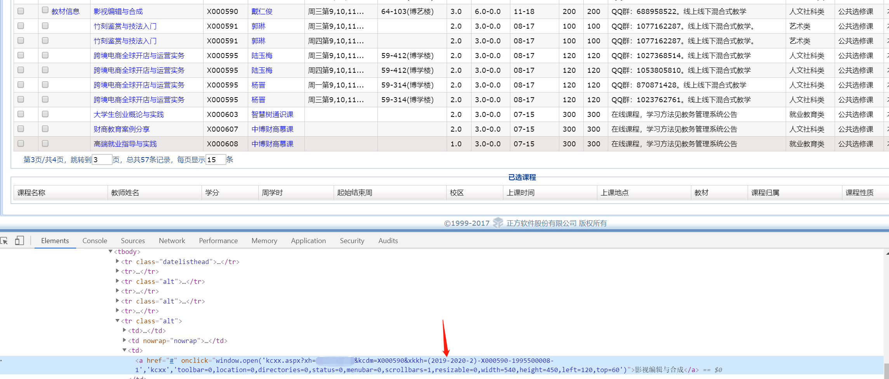

**严禁将此代码滥用，后果自负，源代码仅供交流**
## 版本号
Version 3.0

# 江理工选课脚本
本脚本通过微信公众号的接口进行提交，模拟人工提交。

> 接口竟然连鉴权都没有，可以随意退课、选课、查课。

> 请不要用于非法用途，否则后果自负。

## 脚本使用说明
本来呢，这个是一个利于我自己的一个修改参数就能跑的Python脚本。

后来发现，这个接口一直有效，故将其贡献给大家参考吧。

所以，后来用LayUI做了一个Web界面，做了一点网页交互。

目前还不可以直接通过网页端进行控制脚本的启动、暂停，如有兴趣，欢迎Fork。

### 使用方法
1. 运行`webSevice.py`网页API服务
2. 打开`http://127.0.0.1:5002/`网址
3. 配置相关配置，保存
4. 运行`main.py`脚本

### 如何全自动抢课？
全自动抢课依靠Python脚本的无限轮询。

首先你需要确定你需要抢的哪些课，这些可以再网页中进行操作。

1. 在网页中的`当前可选课程`中，添加想要选择的课进入待选
2. 全部选择完成后，可以在`待抢课信息`中看到你之前选择的
3. 确认后，保存到文件即可

在这之后，运行`main.py`文件即可：
```python
python main.py
```
成功选中一门课后，会自动停止运行。

### 如何设置推送？
如果需要在抢课成功后推送到微信中，可以尝试使用Server Chan微信推送服务

http://sc.ftqq.com/3.version

申请好了`SCKEY`后，替换掉`json/config.json`下的`serverchan`字段即可，若不需要则留空。

### config.json配置文件说明
```json
{
    // Server酱推送的SCKEY
    "serverchan"        : "",
    // 重复次数，即每次刷新列表后若匹配到了需要抢的课程会重复这么多次抢课操作
    // 此举是因为抢课那边的API接口有时候虽然返回成功，但是依旧是没有抢上的操作
    "repeatTimes"       : 5,
    // 每次刷新的最大时间
    "refresh_time_up"   : 2,
    // 每次刷新的最小时间
    "refresh_time_down" : 0,
    // 学生ID
    "student_id"        : "2018144138"
}
```

### 如何手动添加待选课列表？
在`json/addition.json`中，添加你想要添加的即可。对应格式如下：
```json
{
  "选课课号": "课程名称"
}
```
事实上，我们不会去判断课程名称是否一致，我们值判断了选课课号是否一致。课程名称与真实课程名称不同也是可以的，这是为了便于区分每门课。


### 速度如何？
首先，肯定比手工快。刷新速度最低可以是0，所以可以实现在1秒内重复请求N次。

其次，全自动。只需要设置一个学号，选好你要选择的课，启动即可，抢到了自然会发推送信息给你。

实际使用效果是一旦开启了，我基本都抢到了。

使用这个工具抢到了接近十一节网课，所以速度是肯定没问题的。

另外，这个可以一直挂着直到选课时间截至，因为中途会有退课等多出来的位置，所以可以捡漏。建议在捡漏的时候，时间间隔设置在2-4秒左右。

### 常见问题
1. 刷新速度如何设置？
速度建议在1秒以上，设置0固然爽，但是容易个服务器造成压力，从而导致你的IP被Ban。
之前由于设置太快，应该是被ban过一次。

2. 抢课逻辑？
刷新可选课程列表 -> 若有课程是需要抢的 -> 提交选课 -> 判断已选列表内是否有选课信息


## 选课号获取方法

1. 进入教务系统，选课列表（一般提前一天会公布）
2. 开启浏览器`开发者工具(F12)`，选择你想查看的课程名称，定位其元素
3. 查看元素的`onclick`值，里面的`xkkh`就是了

